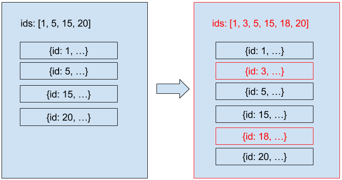

# `@m6web/normalizer`

[](https://github.com/M6Web/normalizer/actions/workflows/continuous-integration.yml)


JS Data normalizer used at [Bedrock Streaming](https://www.bedrockstreaming.com/) in our React frontend apps.
Mainly designed and produced by [@flepretre](https://github.com/flepretre)

## Installation

```shell script
yarn add -E @m6web/normalizer
```

```shell script
npm install @m6web/normalizer
```

Much of application data is presented in the form of a list of entities.
In general, it is assumed that these entities never change, which is usually the case.

During navigation, the application will retrieve new lists of entities.
Among these new lists, some entities are already known.
In order to avoid making useless returns, we have introduced the **normalizer**.
Its role is to normalize the list of elements and not to replace the elements already known in our reducers.
In other words, the normalizer allows us to ensure the immutability of our lists of entities while deleting the rerendering of elements already present in the page.

## Architecture of a list of elements

The trick to avoid resending all the elements of a list is to store the list in two parts.

- the list of **ids** of the elements of the list, sorted in the display order
- an **index** containing all the elements, indexed by their **id**.

This data structure (plus the respect of immutability in the store) allows us to do two things.
First, it is easy to know if the list display needs to be refreshed.
If the list of **ids** has changed, the display must be refreshed, otherwise we do nothing.
Secondly, it is easy to know if an item needs to be refreshed.
If the object is different, then its display must be updated, otherwise nothing is done.



Here, if we use [PureComponents](https://facebook.github.io/react/docs/react-api.html#react.purecomponent), only red elements will trigger rerender.

## Use normalize

#### Reducer

```jsx harmony
import { GET_ELEMENTS } from "./element.actions";
import Normalizer from "@m6web/normalizer";

export const initialState = {
  elementsById: {}, // Index of elements
  elementIds: [] // List of ids
};

// Init of normalizer
const normalizer = new Normalizer("elementIds", "elementsById");

export default (state = initialState, action) => {
  switch (action.type) {
    case GET_ELEMENTS: {
      return normalizer.set(state, action.data, action.serviceCode);
    }
    default: {
      return state;
    }
  }
};
```

- The `elementIds` variable contains the current list of elements to display
- The `elementsById` variable contains all the elements already retrieved, indexed by their id

#### Components

```jsx harmony
import React, { PureComponent } from "react";
import { connect } from "react-redux";

// Element
class Element extends PureComponent {
  render() {
    const { element } = this.props;

    return <li key={element.id}>{element.name}</li>;
  }
}

// List
const List = ({ elementsById, elementIds }) => (
  <ul>
    {elementIds.map(id => (
      <Element element={elementsById[id]} />
    ))}
  </ul>
);

// Connector
const mapStateToProps = ({ elements: { elementsById, elementIds } }) => ({
  elementsById,
  elementIds
});
export default connect(mapStateToProps)(List);
```

The element benefits from the `shouldComponentUpdate` of the `PureComponent` which does a _shallowEquals_ on its props.
The list is connected, so it benefits from the **pure** status of the `connect` of `react-redux`.

## Advanced uses

The third parameter of the normalizer constructor is the index key. By default, it is `'id'`.

The `append` method of the normalizer allows to add the ids of new elements to the list of **ids**.
In other words, the ids of the elements present in the list of **ids** are not deleted contrary to the `set` method.
The elements already present in the list of **ids** are ignored.

The `append` and `set` methods accept a second parameter. The latter allows to specify a path for the storage of ids.

It is possible to define a method via the `shouldElementBeUpdated()` function, which determines whether or not an element should be updated.

Example:

```jsx harmony
const programByFolderNormalizer = new Normalizer(
  "programIdByFolder",
  "simpleProgramsById"
).shouldElementBeUpdated(
  (element, newElement) =>
    element.parent_context.highlighted !== newElement.parent_context.highlighted
);
```
